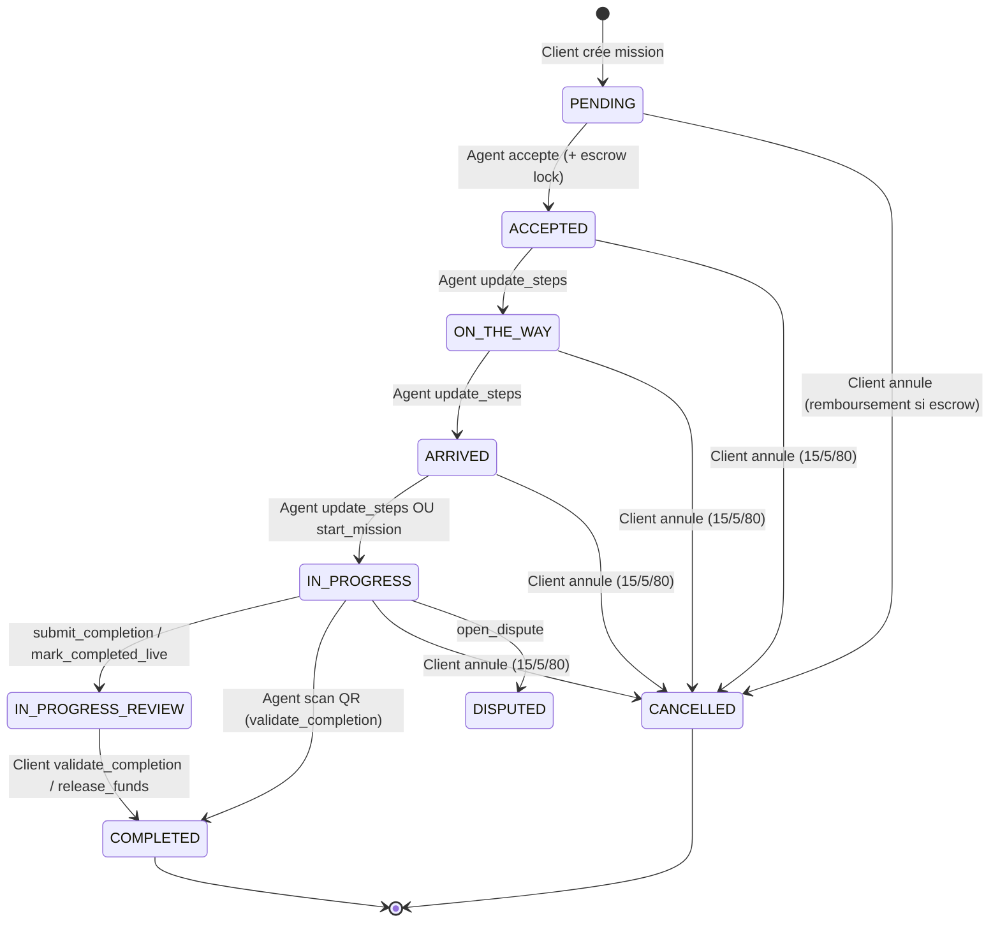

# Audit Financier & États de Mission — FONACO / FONAQO

**Date :** 21 juin 2025  
**Statut :** Audit pré-production — **aucun paiement réel activé**  
**Périmètre :** `apps/escrow/`, `apps/payments/`, `apps/boosts/`, `apps/missions/`, Flutter agent/client, SuperAdmin

---

## 1. Synthèse exécutive

| Domaine | Verdict | Action |
|---------|---------|--------|
| Séquestre mission (Scénario A) | ✅ Conforme avec réserves | Lock à l'acceptation agent, pas à la création |
| Split libération (Scénario B) | ✅ Conforme (88/8/2/2 avec influenceur) | Ledger influenceur ajouté |
| Achat Boost (Scénario C) | ✅ Corrigé | FeexPay ne crédite plus le wallet agent |
| Annulation 15/5/80 (Scénario D) | ✅ Conforme | Hardcodé, ledger OK |
| Relevé mensuel agent | ✅ Corrigé | Stats missions + validation PDF |
| Cycle de vie mission | ✅ Documenté | Sync Flutter via `AgentProvider` |
| UX SuperAdmin / Flutter | ✅ Corrigé | Double confirmation, espacement, facture |

**Réserves production :** `FEEXPAY_SANDBOX=True`, tests de charge non exécutés, `release_purchase_to_agent` débite `balance` et non `escrow_balance` (achats matériels).

---

## 2. Scénario A — Création & Séquestre de Mission

### 2.1 Flux centimes (exemple : mission 10 000 FCFA service + 2 000 FCFA frais = 12 000 FCFA escrow)

```
Client paie → Wallet client crédité → Agent accepte → Escrow lock 12 000 FCFA
```

| Étape | Acteur | Fonction Python | Modèles / Transactions | Mouvement FCFA |
|-------|--------|-----------------|------------------------|----------------|
| 1a | Client | `FeexPayService.init_payment` + `apply_success` | `Payment` (purpose=`MISSION_PAYMENT`), `Wallet`, `Transaction` (DEPOSIT) | +12 000 sur `wallet.balance` client |
| 1a-Ledger | — | `ledger_integration.record_feexpay_deposit` | `LedgerEntry` FEEXPAY_DEPOSIT | `external:feexpay` → `wallet:{client}` |
| 1b | Client | `EscrowService.assert_sufficient_balance` | `Wallet` | Vérifie `balance >= total_required` |
| 2 | Système | `EscrowService.lock_on_accept` | `Escrow` (HELD), `Transaction` (ESCROW_LOCK) | `balance` −12 000, `escrow_balance` +12 000 |
| 2-Ledger | — | `ledger_integration.record_escrow_lock` | `LedgerEntry` ESCROW_LOCK | `wallet:{client}` → `escrow:{client}` |

**Option 1 — FeexPay :** `apps/payments/services.py` → `FeexPayService.init_payment`, `verify_payment`, `apply_success` (purpose `MISSION_PAYMENT`).  
**Option 2 — Wallet interne :** Le client doit avoir rechargé son wallet ; le lock se fait à l'acceptation via `assert_sufficient_balance` + `lock_on_accept`.

**Déclencheur lock :** `MissionViewSet.accept` (`apps/missions/views.py` L460) appelle `EscrowService.lock_on_accept(mission)` après assignation agent.

### 2.2 Écarts identifiés

| Écart | Gravité | Détail |
|-------|---------|--------|
| `total_required_balance` | P2 | Additionne `escrow_amount + purchase_amount` — risque double-compte si `material_cost` déjà dans escrow |
| `release_purchase_to_agent` | P2 | Débite `wallet.balance` au lieu de `escrow_balance` pour achats matériels |
| Sandbox deposit | P3 | `wallets/views.py` recharge sans ledger en mode sandbox |

---

## 3. Scénario B — Clôture & Moteur de Split

### 3.1 Formule (gross = montant escrow, défaut config 88 % / 10 % / 2 %)

| Bénéficiaire | Sans influenceur | Avec influenceur (2 %) |
|--------------|------------------|------------------------|
| Agent | 88 % | 88 % |
| FONACO (`platform@fonaqo.system`) | 10 % | 8 % (10 % − 2 %) |
| Influenceur | — | 2 % (`Influencer.commission_rate`) |
| Réserve (`reserve@fonaqo.system`) | 2 % (reste) | 2 % (reste) |

**Exemple sur 10 000 FCFA :**

| Cas | Agent | FONACO | Influenceur | Réserve |
|-----|-------|--------|-------------|---------|
| Sans influenceur | 8 800 | 1 000 | 0 | 200 |
| Avec influenceur | 8 800 | 800 | 200 | 200 |

### 3.2 Chaîne d'exécution

| Étape | Fonction | Fichier | Effet |
|-------|----------|---------|-------|
| Validation client | `MissionViewSet.validate_completion` | `missions/views.py` L799 | Vérifie `IN_PROGRESS_REVIEW` |
| Libération escrow | `EscrowService.release_to_agent` | `escrow/services.py` L221 | Split + wallets |
| Tx agent | `Transaction` ESCROW_RELEASE | `wallets/models.py` | +88 % agent `balance` |
| Tx plateforme | `Transaction` INSURANCE_FEE | idem | +part FONACO |
| Tx réserve | `Transaction` INSURANCE_FEE | idem | +2 % réserve |
| Influenceur | `Influencer.earnings_balance` | `accounts/models.py` | +2 % |
| Audit trail | `EscrowSplitRecord` | `escrow/models.py` | 1 ligne par bénéficiaire |
| Ledger agent | `record_escrow_release_to_agent` | `finance/ledger_integration.py` | MISSION_PAYMENT |
| Ledger FONACO | `record_platform_revenue` | idem | ESCROW_RELEASE |
| Ledger réserve | `record_reserve_revenue` | idem | ESCROW_RELEASE |
| Ledger influenceur | `record_influencer_commission` | idem | **Ajouté cet audit** |

**Config :** `PlatformConfigService` clés `SPLIT_AGENT_PCT`, `SPLIT_PLATFORM_PCT` (`apps/core/services.py`).  
**Note :** `SPLIT_INFLUENCER_PCT` en config staff n'est pas utilisé — seul `Influencer.commission_rate` compte.

---

## 4. Scénario C — Achat Boost Agent

### 4.1 Flux wallet (corrigé)

| Étape | Fonction | Mouvement |
|-------|----------|-----------|
| Vérif solde | `AgentBoostViewSet.purchase` | `wallet.balance >= plan.price` |
| Débit agent | idem | `agent.balance − amount` |
| Crédit FONACO | `get_platform_wallet()` | `platform.balance + amount` |
| Tx agent | `Transaction` BOOST_PAYMENT | Montant négatif |
| Tx plateforme | `Transaction` DEPOSIT | Montant positif |
| Ledger | `record_boost_wallet` | `wallet:{agent}` → `platform:revenue` |

### 4.2 Flux FeexPay (corrigé — bug critique fermé)

**Avant :** `verify_payment` avec purpose par défaut `WALLET_DEPOSIT` créditait le wallet agent → boost gratuit + double dépense possible.

**Après :**

| Étape | Fonction | Mouvement |
|-------|----------|-----------|
| Vérif paiement | `FeexPayService.verify_payment(..., purpose=BOOST_PURCHASE)` | Sandbox ou API live |
| Application | `apply_success` branche `BOOST_PURCHASE` | Crédit **plateforme uniquement** |
| Ledger | `record_boost_feexpay` | `external:feexpay` → `platform:revenue` |
| Activation | `AgentBoost.objects.create` | Boost actif N heures |

**Fichiers modifiés :** `apps/boosts/views.py`, `apps/payments/services.py`, `apps/finance/ledger_integration.py`, `apps/escrow/services.py` (`get_platform_wallet` public).

---

## 5. Scénario D — Pénalité Annulation (15 % / 5 % / 80 %)

**Condition :** Mission acceptée par agent, annulation client (`cancel_mission`).

| Bénéficiaire | % | Libellé transaction |
|--------------|---|---------------------|
| Agent | 15 % | « Indemnisation pour annulation de mission » |
| FONACO | 5 % | Frais administratifs annulation |
| Client | 80 % | Remboursement sur `wallet.balance` |

| Fonction | Fichier |
|----------|---------|
| `EscrowService.cancel_with_agent_compensation` | `escrow/services.py` L507 |
| `ledger_integration.record_cancel_compensation` | `finance/ledger_integration.py` L185 |
| Déclencheur | `MissionViewSet.cancel_mission` L903 |

**Statuts éligibles compensation :** `ACCEPTED`, `ON_THE_WAY`, `ARRIVED`, `IN_PROGRESS`.  
**PENDING sans agent :** remboursement intégral via `refund_to_client`.

---

## 6. Table de vérité — Statuts de Mission

### 6.1 États et transitions



### 6.2 Déclencheurs détaillés

| Transition | Acteur | Endpoint / Action | Sync Flutter |
|------------|--------|-------------------|--------------|
| → PENDING | Client | `POST missions/` | `MissionProvider` |
| → ACCEPTED | Agent | `POST missions/{id}/accept/` | `AgentProvider.acceptMission` → `upsertMission` |
| → ON_THE_WAY | Agent | `POST missions/{id}/update_steps/` status=ON_THE_WAY | `refreshMissionFromServer` |
| → ARRIVED | Agent | `update_steps` status=ARRIVED | idem |
| → IN_PROGRESS | Agent | `update_steps` ou `start_mission` | idem |
| → IN_PROGRESS_REVIEW | Agent | `submit_completion` / `mark_completed_live` | idem + notif client |
| → COMPLETED | Client | `validate_completion` / `release_funds` | Client `MissionProvider.upsertMission` ; Agent refresh |
| → CANCELLED | Client | `cancel_mission` | Refresh des deux côtés |
| → DISPUTED | Client/Agent | `open_dispute` | Statut figé jusqu'à arbitrage staff |

### 6.3 Machine à états backend

```python
# apps/missions/views.py
_MISSION_TRANSITIONS = {
    'ACCEPTED': {'ON_THE_WAY'},
    'ON_THE_WAY': {'ARRIVED'},
    'ARRIVED': {'IN_PROGRESS'},
}
```

Validé par `_validate_mission_transition` avant chaque `update_steps`.

### 6.4 Synchronisation Flutter

| Mécanisme | Fichier | Rôle |
|-----------|---------|------|
| `AgentProvider.upsertMission` | `agent_provider.dart` | Met à jour listes available/assigned/active |
| `AgentProvider.refreshMissionFromServer` | idem | GET détail mission → upsert |
| Polling client | `mission_detail_screen.dart` | Timer 10 s si mission non finale |
| WebSocket | `missions/consumers.py` | Push temps réel (chat + events) |

---

## 7. Relevé Mensuel Agent — Diagnostic & Correctif

### 7.1 Symptômes rapportés

- Téléchargement échoue en boucle côté app agent (wallet → « Relevé »).
- PDF incomplet (pas de synthèse missions).

### 7.2 Cause racine

| Problème | Détail |
|----------|--------|
| Filtre statut tx | `status='COMPLETED'` (string) au lieu de `TransactionStatus.COMPLETED` — risque de liste vide selon DB |
| PDF sans métriques métier | Manquait Total gagné, Missions effectuées, Commissions |
| Flutter | Fichier écrasé `releve_mensuel.pdf` ; pas de validation en-tête `%PDF` |

### 7.3 Correctifs appliqués

**Backend** (`apps/missions/views.py` → `monthly_report`) :
- Filtre `TransactionStatus.COMPLETED`
- Agrégats : `completed_missions`, `mission_earnings` (ESCROW_RELEASE+), `commissions_withheld` (EscrowSplitRecord hors AGENT), `boost_spend`
- Try/except avec log et HTTP 500 explicite

**PDF** (`apps/missions/monthly_report_pdf.py`) :
- Section « 2. SYNTHÈSE MISSIONS DU MOIS »
- Section mouvements renumérotée en 3

**Flutter** (`agent_mission_repository_impl.dart`) :
- Fichier `releve_mensuel_YYYY-MM.pdf`
- Validation magic bytes `%PDF`
- Log HTTP status en cas d'échec

### 7.4 Format cible du relevé

| Champ | Source |
|-------|--------|
| Total gagné | Σ `Transaction` ESCROW_RELEASE crédits du mois |
| Missions effectuées | Count `Mission` COMPLETED du mois |
| Commissions prélevées | Σ `EscrowSplitRecord` (PLATFORM + INFLUENCER) |
| Dépenses boost | Σ `Transaction` BOOST_PAYMENT |
| Mouvements détaillés | Table wallet transactions |
| Format | PDF ReportLab A4 (`build_agent_monthly_report_pdf`) |

**Endpoint :** `GET /api/v1/missions/statistics/monthly_report/?month=YYYY-MM`  
**Permission :** `IsAgent`

---

## 8. Correctifs UX (Flutter & SuperAdmin)

| Tâche | Fichier | Correctif |
|-------|---------|-----------|
| Double validation config | `static/super_admin/admin.js` | `showConfirm` sur frais, split, promo boost, délai agent, CRUD plans boost |
| Espacement notifications | `agent_notifications_screen.dart` | `Padding(vertical: 6)` + `Card` arrondi, marge liste 16px |
| Facture fin de mission | `mission_invoice_card.dart` | Suppression aperçu ; bouton « Télécharger la facture » seul |

---

## 9. Matrice Ledger ↔ Wallet (post-audit)

| Flux | Ledger | Wallet |
|------|--------|--------|
| Escrow lock | ✅ | ✅ |
| Release agent/platform/réserve | ✅ | ✅ |
| Influenceur | ✅ **nouveau** | ✅ earnings_balance |
| Annulation 15/5/80 | ✅ | ✅ |
| Boost wallet | ✅ **nouveau** | ✅ agent + platform |
| Boost FeexPay | ✅ **nouveau** | ✅ platform only |
| FeexPay mission pré-financement | ✅ | ✅ |
| Sandbox deposit manuel | ❌ | ✅ |
| Payout approuvé | ✅ | ✅ |

---

## 10. Checklist pré-production paiements réels

- [ ] `FEEXPAY_SANDBOX=False` + clés live rotatées
- [ ] `DEBUG=False`, `ADMIN_ALERT_EMAILS` configuré
- [ ] Tests de charge escrow (100+ missions simultanées)
- [ ] Corriger `release_purchase_to_agent` → débit escrow
- [ ] Reconciliation nightly validée en staging
- [ ] Revue manuelle 10 missions réelles en sandbox FeexPay live
- [ ] Monitoring alertes `Ledger reconciliation MISMATCH`

---

## 11. Tests exécutés

```
docker compose exec web python manage.py test tests -v 1
→ 82 tests OK (21 juin 2025)
```

---

*Document généré dans le cadre de l'audit CTO pré-production FONACO. Ne pas activer les paiements réels tant que la checklist §10 n'est pas validée.*
