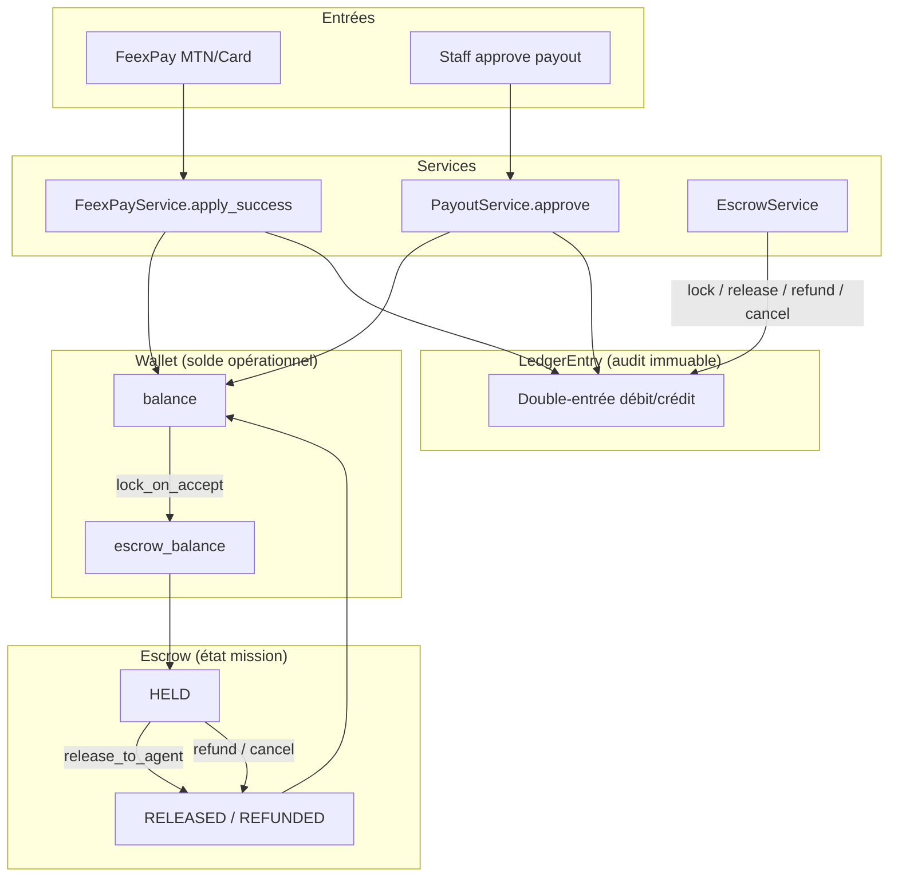

# Rapport Audit P0 + Intégration Ledger — 21 Juin 2026

## Partie 1 — Corrections sécurité P0 (IMMÉDIAT)

### 1.1 Dispute IDOR — CORRIGÉ

**Fichier :** `apps/disputes/serializers.py`

- Ajout de `validate_mission()` : seuls le client ou l'agent assigné peuvent ouvrir un litige.
- Restriction liste staff : `is_staff` retiré, seul `is_superuser` voit tous les litiges.

### 1.2 Withdrawal permissions — CORRIGÉ

**Fichier :** `apps/payments/views.py`

- `WithdrawalViewSet` : `permission_classes = [IsAuthenticated, IsAgent]`
- Blocage explicite des comptes clients (`PermissionDenied`)
- Aligné avec `wallets/withdraw/`

### 1.3 Rotation secrets — CORRIGÉ

| Fichier | Action |
|---------|--------|
| `.env.example` | Secrets réels supprimés, placeholders uniquement |
| `.env` | Nouveau `SECRET_KEY` généré, `MISTRAL_API_KEY` remplacé par placeholder |

**Action manuelle requise :** révoquer l'ancienne clé Mistral sur console.mistral.ai et regénérer Firebase si `firebase-auth.json` a été exposé.

### 1.4 Routes critiques `IsAuthenticated` seul — CORRIGÉ

| Endpoint | Avant | Après |
|----------|-------|-------|
| `POST /api/v1/payments/withdraw/` | `IsAuthenticated` | `IsAuthenticated + IsAgent` |
| `POST /api/v1/wallets/withdraw/` | `IsAuthenticated` + check runtime | `IsAuthenticated + IsAgent` |
| `AgentBoostViewSet` | `IsAuthenticated` | `IsAuthenticated + IsAgent` |
| `AgentStatisticsViewSet` | `IsAuthenticated` + bug FK | `IsAuthenticated + IsAgent` + `filter(agent=user)` |
| `/api/schema/`, `/api/docs/` | Public | DEBUG=public, prod=`IsAdminUser` |
| DRF global | Pas de default | `DEFAULT_PERMISSION_CLASSES = [IsAuthenticated]` |

### 1.5 Tests ajoutés

`tests/test_security_p0.py` :
- Dispute IDOR rejeté (400)
- Client bloqué sur retrait payments
- Agent autorisé sur retrait
- Ledger créé sur escrow lock

---

## Partie 2 — Intégration LedgerService

### 2.1 Nouveau module

**`apps/finance/ledger_integration.py`** — pont double-entrée entre `Wallet.Transaction` et `LedgerEntry`.

### 2.2 Flux branchés

| Service | Méthode | Type Ledger |
|---------|---------|-------------|
| `EscrowService` | `lock_on_accept` | `ESCROW_LOCK` |
| `EscrowService` | `release_to_agent` | `MISSION_PAYMENT` + `ESCROW_RELEASE` (platform) |
| `EscrowService` | `refund_to_client` | `ESCROW_REFUND` |
| `EscrowService` | `cancel_with_agent_compensation` | `ESCROW_REFUND` + `MISSION_PAYMENT` + `ESCROW_RELEASE` |
| `EscrowService` | `release_purchase_to_agent` | `MISSION_PAYMENT` |
| `EscrowService` | `apply_negotiated_price_increase` | `ESCROW_LOCK` (avenant) |
| `PayoutService` | `approve` | `PAYOUT_APPROVED` |
| `FeexPayService` | `apply_success` | `FEEXPAY_DEPOSIT` |

Idempotency : références `LEDGER-{prefix}-{suffix}` — doublon ignoré silencieusement.

### 2.3 Flux non encore branchés (hors scope critique)

| Service | Méthode | Raison |
|---------|---------|--------|
| `EscrowService` | `release_material_to_agent` | Flux admin rare, réserve matériel |
| `PayoutService` | `reject` | Pas de mouvement wallet |

---

## Partie 3 — Diagramme flux financiers



```
┌─────────────────────────────────────────────────────────────────────────────┐
│                           FLUX FINANCIERS FONAQO                            │
└─────────────────────────────────────────────────────────────────────────────┘

  [FeexPay MTN/Card]                    [Staff approve]
         │                                      │
         ▼                                      ▼
  FeexPayService.apply_success()      PayoutService.approve()
         │                                      │
         ├─► Wallet.balance += amount           ├─► Wallet.balance -= amount
         ├─► Transaction (DEPOSIT)              ├─► Transaction (WITHDRAWAL)
         └─► LedgerEntry (FEEXPAY_DEPOSIT)      └─► LedgerEntry (PAYOUT_APPROVED)
                    │                                      │
                    └──────────────┬───────────────────────┘
                                   ▼
                         ┌─────────────────┐
                         │  Wallet (solde)  │ ◄── SOURCE OPÉRATIONNELLE
                         └────────┬────────┘
                                  │
                    Client accepte mission
                                  │
                                  ▼
                    EscrowService.lock_on_accept()
                         ├─► balance → escrow_balance
                         ├─► Transaction (ESCROW_LOCK)
                         └─► LedgerEntry (ESCROW_LOCK)
                                  │
                                  ▼
                         ┌─────────────────┐
                         │ Escrow (HELD)   │
                         └────────┬────────┘
                                  │
              ┌───────────────────┼───────────────────┐
              │                   │                   │
         Mission OK          Annulation           Litige
              │                   │                   │
              ▼                   ▼                   ▼
   release_to_agent()    refund_to_client()    refund_to_client()
              │                   │                   │
   ├─ Agent 88%          ├─ Client 100%        └─ idem
   ├─ Platform 10%       ├─ Transaction
   ├─ Reserve 2%         └─ LedgerEntry (ESCROW_REFUND)
   ├─ Transaction(s)
   └─ LedgerEntry(s)
              │
              ▼
   ┌──────────────────────────────────────┐
   │  LedgerEntry (table `ledger`)        │ ◄── SOURCE AUDIT IMMUTABLE
   │  Double-entrée débit/crédit           │
   └──────────────────────────────────────┘
```

---

## Partie 4 — Source de vérité financière

| Couche | Rôle | Mutabilité | Usage |
|--------|------|------------|-------|
| **`Wallet.balance`** | Solde opérationnel temps réel | Mutable | UI, vérifications solde, escrow |
| **`Wallet.Transaction`** | Journal wallet utilisateur | Mutable | Historique user, exports CSV |
| **`LedgerEntry`** | Audit trail comptable | **Immuable** (append-only) | Conformité, réconciliation, audit CTO |
| **`Escrow`** | État séquestre mission | Semi-mutable (statut) | Workflow mission |
| **`Payment`** | État paiement FeexPay | Mutable (statut) | Idempotency FeexPay |

### Verdict

**Il n'y a pas encore une seule source de vérité** — c'est un modèle **dual** intentionnel :

1. **Opérationnel** : `Wallet` (solde affiché à l'utilisateur)
2. **Audit** : `LedgerEntry` (piste immuable, réconciliation)

Les deux sont synchronisés à chaque flux critique depuis cette correction. La réconciliation se fait via `transaction_id` (FK vers `Wallet.Transaction.id`).

### Prochaines étapes recommandées

- [x] Brancher ledger sur `cancel_with_agent_compensation`, `release_purchase_to_agent`, `apply_negotiated_price_increase`
- [x] Rapprochement nocturne Ledger ↔ Wallet (Celery beat 02:00)
- [x] Endpoint staff `/api/v1/staff/ledger/` (liste, filtres, export CSV, rapprochement)
- [x] Immutabilité `LedgerEntry` (save/update/delete interdits)
- [x] Brancher ledger sur `release_material_to_agent` + part réserve `release_to_agent`
- [x] Alertes staff : `AdminNotification` + email + API `/staff/notifications/`
- [ ] Révoquer ancienne clé Mistral + Firebase si exposés

---

## Partie 5 — Sécurité Firebase (vérification immédiate)

**Commande exécutée :**
```bash
cd fonaqo_back && git log --all --oneline -- firebase-auth.json
```

**Résultat :** historique Git **vide** — `firebase-auth.json` n'a **jamais été commité**.

| Contrôle | Statut |
|----------|--------|
| `git log --all -- firebase-auth.json` | Aucun commit |
| `git ls-files firebase-auth.json` | Non tracké |
| `.gitignore` ligne 3 | `firebase-auth.json` ignoré |
| Fichier local présent | Oui (montage Docker, hors Git) |

**Verdict :** pas de rotation Firebase urgente liée à une fuite Git. Le fichier reste sensible en local — ne jamais retirer de `.gitignore`.

---

## Partie 6 — Rapprochement & API Staff (21 Juin 2026)

### 6.1 Job nocturne

| Élément | Détail |
|---------|--------|
| Tâche | `apps.finance.tasks.reconcile_wallet_ledger` |
| Schedule | `crontab(hour=2, minute=0)` — Africa/Porto-Novo |
| Logique | `LedgerService.get_balance('wallet:{id}')` vs `Wallet.balance` + idem escrow |
| Persistance | `LedgerReconciliationRun` (status OK / MISMATCH / ERROR) |
| Alerte | `AdminNotification` CRITICAL si écart |

### 6.2 Endpoints staff

| Route | Description |
|-------|-------------|
| `GET /api/v1/staff/ledger/` | Liste paginée + filtres (`entry_type`, `user_id`, `mission_id`, `q`, dates) |
| `GET /api/v1/staff/ledger/<uuid>/` | Détail entrée |
| `GET /api/v1/staff/ledger/export/` | Export CSV (max 10 000 lignes) |
| `GET /api/v1/staff/ledger/reconciliation/` | Historique rapprochements |
| `GET /api/v1/staff/ledger/balance/<uuid>/` | Comparaison Wallet vs Ledger |

Auth : `IsAdminUser` + JWT/Session.

### 6.3 Immutabilité LedgerEntry

- `save()` : interdit si `_state.adding` est False
- `delete()` : toujours interdit
- `QuerySet.update()` / `QuerySet.delete()` : interdits
- Django Admin : lecture seule (pas d'add/change/delete)
- Corrections futures : utiliser `CORRECTION` / `REVERSAL` (nouvelles entrées, jamais mutation)

---

## Commandes vérification

```bash
docker compose exec web python manage.py test tests/test_security_p0.py -v 2
docker compose exec web python manage.py test tests -v 1
docker compose restart web worker beat
```
